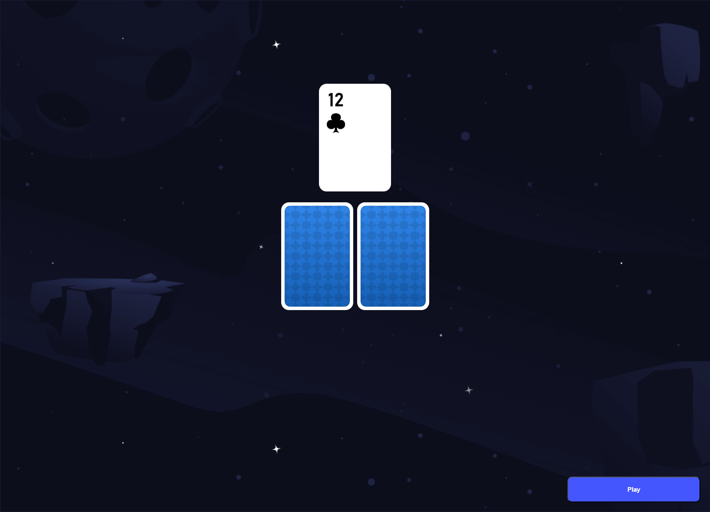

# Карточная Мини-Игра на Vue.js, Vite и TS
**[Ссылка на игру](https://den-dev97.github.io/cards/ "cards mini game")**

Этот проект представляет собой мини-игру с карточками, разработанную на Vue.js с использованием сборщика Vite. Игра предлагает пользователю переворачивать карточки. Проект создан для демонстрации базовых возможностей Vue.js, включая реактивность, использование анимации и адаптивность.

## Технологии
- Vue.js 3: Фреймворк для создания пользовательских интерфейсов.
- Vite: Сборщик и сервер разработки.
- TypeScript: Строго типизированный язык программирования.
- CSS: Стилизация компонентов.

## Функциональность
- Переворачивание карточек по клику.
- Анимация переворота карточек.
- Адаптивный дизайн для различных размеров экрана.
- Оптимизированные изображения для быстрой загрузки

## Установка

1. Клонируйте репозиторий:

`git clone git@github.com:den-dev97/cards.git`

2. Перейдите в директорию проекта:

`cd cards`

3. Установите зависимости:

`npm install`

## Запуск проекта

Чтобы запустить проект на вашем локальном компьютере, выполните следующую команду:

`npm run dev`

## Использование

1. Откройте веб-приложение в браузере.
2. Нажмите кнопку "Play" для начала игры.
3. Кликните по карточке для её переворота.

## Лицензия

Этот проект распространяется под лицензией MIT.
